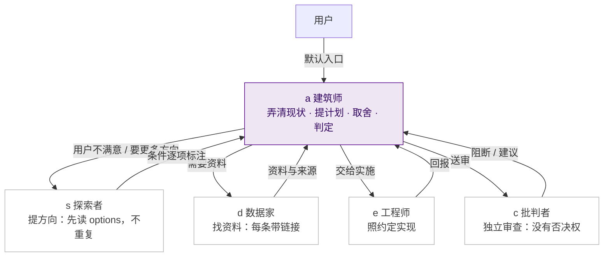
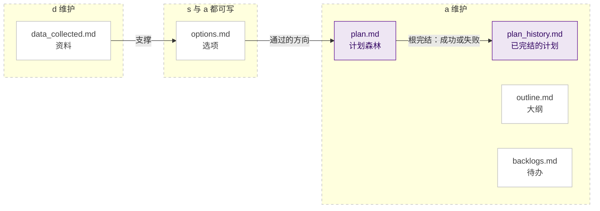

# 人格面具 persona-masks

让 AI 助手把「想、做、查」分开的一套轻量角色约定，做成文件型 skill。你只和 `a`（建筑师）对话，由它按需呼叫探索、查资料、实施、审查四个面具；核心只是几份 Markdown 规则，需要更严的流程时，再选装任务书驱动的习惯包。

> 状态：试用版（0.4.1）。a、c、e 的任务书流程已在作者的教科书写作中实际使用；循环 asd 调整过几次，尚未完全验证。没有对照实验证明它比普通提示更有效，也没有强制路由或后台监听，只是一组放在文件里的文字约定。

## 为什么

让一个助手既想方案、又写代码、又自己验收，容易出现同一个人给自己打分，挑毛病的人也在替你做决定。人格面具把这几件事拆开，每次只戴一个主角色：

- **不让 AI 自己给自己打分**：想方案、动手做、挑毛病分给不同的面具；`c` 在独立的上下文里审查，没有否决权，是否合格由 `a` 判定。
- **分工靠态度，不靠知道多少**：`a` 觉得该怎么做，`c` 挑毛病，`e` 照约定做。回答里谁越界了，一眼能看出来。
- **纯文本、按需加载**：只有 Markdown，只加载当前角色与启用的模块，Claude Code 与 Codex 都能装；项目里的规矩与经验放在项目自己的 `personas/` 目录，随仓库版控。
- **查资料不凭空**：`d` 要求每条资料带链接，没有来源的说法必须标注。

## 设计取向

- **质量优先，不追求速度。**用更多 token 和预先设定的边界，换更高的质量和更自动的流程；任务小、赶时间的场合不必用全套。
- **用规则，不扭曲 agent。**prompt 尽量精简，只写规则：谁做什么、什么不能做、记录放哪里，不要求 agent 改变本性或扮演不属于它的样子。因此它只依赖「能读文件的 agent」，目前对应 Claude Code 与 Codex 的 skills 目录，其他宿主未实测。
- **用刚性规则保证 s 的新意，而不是要求它「发挥创意」。**s 一律先读 `options.md`，新方向与它所否定的前提不得与已有条目重复；能不能做到，看文件就能核对。
- **搭积木。**系统核心、可选习惯包、项目层三层各自独立，可以只用一块，也可以组合；有预设的工作流（任务书驱动的 a／c／e 循环），也保持自由组合。
- **名字也有规范。**习惯包里规定了 session 的命名格式（角色、实例、任务编号、项目名），多个 session 并行时，通知和查找都靠名字，不靠猜。

五个面具：

| 面具 | 做什么 |
|---|---|
| `s` 探索者 | 暂缓可行性筛选，质疑默认前提，提出方向；先读 `options.md`，不与已有方向重复 |
| `a` 建筑师 | 对话入口：先弄清现状，提计划、取舍、判定合格与否 |
| `e` 工程师 | 照约定实现、测量、验证、交付 |
| `c` 批判者 | 挑毛病：独立审查，指出可能错在哪，没有否决权 |
| `d` 数据家 | 找资料、核来源；每条资料带链接，无来源的标注 |

另有三个可以叠加的**共用模块**：`kis`（类比拆解）、`smd`（逐步指导，含教学检查点）、`wid`（把问答写成文件）；以及一个**循环 `asd`**：用户或 a 定目标，s 思考并呼叫 d 查资料，a 评判可行性，不通过就继续。

## 它们怎么协作

项目里的管理文件由对应的面具维护，没有就不建；首次在项目里戴面具时会提示一次，你同意才建：

## 一眼看懂的用法

在对话里用前缀调用：

- `a$kis$smd#Demo/Q1: 帮我理解并逐步完成当前任务。`：以 a 的身份，叠加 kis 与 smd，工作线 `#Demo`，问题 `Q1`
- 没有写前缀时默认是 a：a 先弄清现状，可以自己提出计划，再按需呼叫 s、d、c、e；你表示不满意、不够有创意或太慢时，a 会自动呼叫 s
- `s: 这个问题有哪些思路？`：直接以 s 进入；回复会标「直接入口，未经 a 判定」，建议改走 `a:`
- `asd: 目标……`：启动目标、探索、找资料、判可行的循环

回复首行会标明当前角色，例如 `〔a 建筑师#Demo/Q1〕`。完整规则见 `persona-masks/SKILL.md`。

## 安装

把整个 `persona-masks/` 文件夹复制到宿主的个人 skills 目录：

- Claude Code：`~/.claude/skills/persona-masks/`
- Codex：`~/.agents/skills/persona-masks/`

两处都装时内容须逐字相同；同一宿主里不要在多个扫描目录重复安装同名包。详见 `persona-masks/INSTALL.md`，其中包括资料目录、可选习惯包与从旧版升级的说明。

## 里面有什么

- `persona-masks/`：包本体
  - `SKILL.md`：入口与路由
  - `references/`：各角色与模块的规则（角色、循环 asd、smd、kis、wid、网页端用法、项目层、资料与日志）
  - `templates/`：项目层 `personas/` 的模板，含大纲、待办、计划（森林结构）、计划历史、选项、资料六份管理文件
  - `habits/`：可选习惯包（任务书驱动的 a／c／e 工作循环、工作手艺、模块调整）
  - `agents/openai.yaml`：只供 Codex 使用的元数据
- `CHANGELOG.md`：版本变更

三层结构：**系统核心**（一定安装）、**习惯包**（逐包询问是否安装）、**项目内容**（不在包内，由使用者在自己的项目里建立）。

## 现状与限制

- 本包只有 Markdown 指令与可选的 Codex 元数据，没有服务、数据库或后台进程。
- 验证程度不同：a、c、e 的任务书流程是作者在教科书写作中实际使用的，取向是质量而不是速度，但没有做过对照实验；循环 asd 是后来加的，调整过几次，没有完全验证；其余部分（默认入口、自动呼叫 s、plan 森林、首次提示）都是新写的，还没有在多个项目里长期试用。「主 agent 派子 agent、子 agent 只回最后一条消息」这种模式本身，Anthropic 与 OpenAI 都有公开资料，但那不能证明本框架的效果。
- c 与 d 的「优先派给外部命令行工具、不可用时回退」是写在规则里的偏好，是否可用取决于你的宿主与本机；作者没有逐一在所有环境实测。
- 网页端没有本机文件系统，只能精简使用（见 `references/web.md`）；网页端的实际限制未经官方文档核实，也未在网页端实测。
- 个人规则与调整日志放在使用者自己的资料目录里，不随包分发。

## 语言

本仓库是中文版，开发阶段以中文为准；英文版在规则成熟后翻译，另设仓库。

## 许可证

Apache License 2.0，全文见 [LICENSE](LICENSE)。
